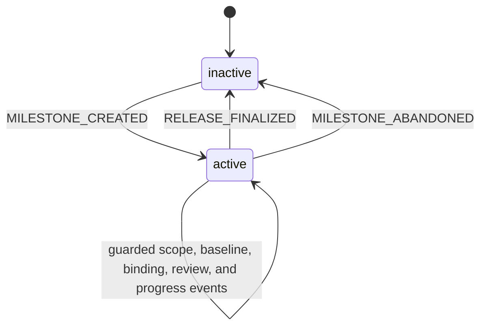
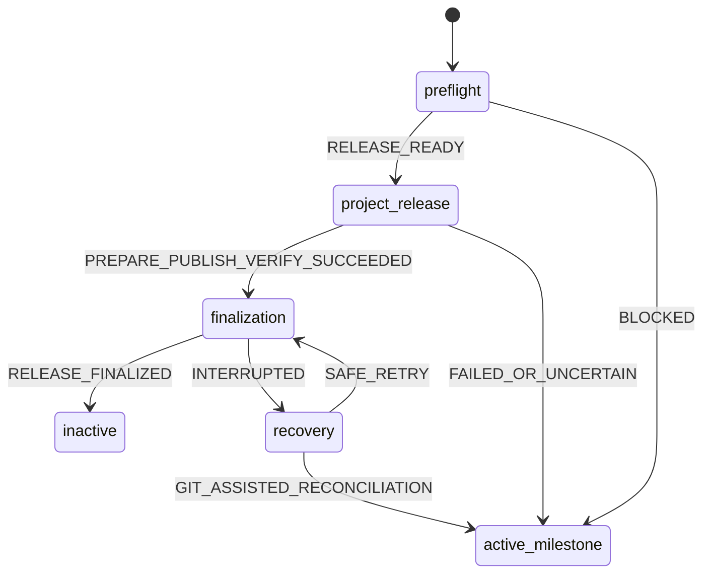

# Milestone state machine

Status: Draft

This document defines the derived project-level lifecycle for the one active milestone represented by `steering/roadmap.md`. It complements the persistent per-Spec states in [Spec state machine](./spec-state-machine.md) and applies the phase-relative dependency semantics accepted by [Decision 0082](./decisions/0082-derived-milestone-state-machine.md).

The model deliberately does not add a top-level Roadmap `status`. Milestone state is a deterministic read model over existing authoritative artifacts.

## Authoritative inputs

| Concern | Authority |
| --- | --- |
| Active milestone identity, baseline, scope, dependency DAG, and target release | `steering/roadmap.md` |
| Spec-backed phase and gate evidence | Each participating Spec's `spec.yaml` |
| Spec-backed implementation plan and execution state | Each participating Spec's `tasks.yaml` |
| Direct completion | Sparse `status: completed` on the Direct Roadmap item |
| Contract-wide semantic acceptance | `state/contract-review.md` when Spec-backed work exists |
| Implementation and completion revision | Current project Git state and per-Spec completion evidence |
| Released milestone history | Versioned Roadmap and applicable review archives plus per-Spec `log.md` |

No input is copied into another artifact merely to make aggregate status easier to render.

## Persistent lifecycle

At the project level, only Roadmap presence is persistent:

| State | Representation | Meaning |
| --- | --- | --- |
| `inactive` | No `steering/roadmap.md` | No milestone is currently active. Released archives may exist. |
| `active` | One valid `steering/roadmap.md` | The milestone remains open, regardless of its derived delivery stage. |

`finalizing` is not persisted. Core finalization is an ordered, idempotent operation whose last completion marker is moving the active Roadmap to its versioned archive. An interrupted operation is diagnosed as recoverable inconsistency, never accepted as a third persistent lifecycle state.

## Derived delivery stages

An active milestone exposes one derived stage for concise status. The stage is the earliest unsatisfied milestone barrier; item-level status explains work that is ahead of that floor.

| Derived stage | Condition |
| --- | --- |
| `requirements` | At least one participating Spec has not reached current Requirements approval. A Direct-only milestone skips this and the following Spec-only stages. |
| `design` | Every participating Spec has current Requirements approval, but at least one has not reached current Design approval subject to its Design dependencies. |
| `cross_spec_review` | Every participating Spec has current Design approval, but the required global review is absent or stale. |
| `tasks` | The review is fresh, but at least one participating Spec lacks current Tasks approval. |
| `implementation` | Every participating Spec has current Tasks approval, but at least one Roadmap item is not implementation-complete. |
| `validation` | Every Roadmap item is implementation-complete, but at least one participating Spec lacks fresh completion evidence at the current clean project revision. Direct-only milestones skip this stage. |
| `release_pending` | Delivery and applicable validation are complete, but release binding or another deterministic release guard still blocks preflight. |
| `release_ready` | All release-readiness predicates pass, including a target release binding. |

`release_pending` is a derived explanation, not a writable `release_blocked` state. Its status output lists the exact release guards that remain unsatisfied.

A Direct-only milestone derives `implementation` until every Direct item is complete, then `release_pending` or `release_ready` from the remaining release guards.

## Item predicates

The CLI flattens Roadmap items into typed identities for computation:

- `spec:<canonical-spec>` for `new_specs` and `spec_updates`
- `direct:<roadmap-local-id>` for `direct_changes`

### Spec-backed predicates

| Predicate | Condition |
| --- | --- |
| `requirements_approved` | The Spec is at `design` or later with fresh Requirements evidence. |
| `design_approved` | The Spec is at `tasks` or later with fresh Requirements and Design evidence. |
| `tasks_approved` | The Spec is at `implementation` or `release_ready` with fresh Requirements, Design, and Tasks evidence. |
| `implementation_complete` | Every Task is completed and none is blocked, and the project worktree is clean at a committed revision. Completion evidence is not required. |
| `validated` | The Spec is `release_ready` with fresh completion evidence whose `implementation_revision` equals the current clean project `HEAD`. |

### Direct predicates

| Predicate | Condition |
| --- | --- |
| `implementation_complete` | The Roadmap item has `status: completed`. |
| `pending` | The Roadmap item omits `status`. |

Direct completion remains sparse current state. A later commit does not erase it, but discovery must reclassify the item if continued work would change canonical Requirements, Design, or Contract artifacts.

## Phase-relative dependency semantics

Roadmap `depends_on` is one DAG with different readiness projections by phase.

### Requirements

Requirements work ignores Roadmap dependencies. Every participating Spec may author and approve its user-visible scope in parallel. Cross-Spec semantic coordination is deferred to Design and the global Contract review.

### Design

Design considers only edges whose source and target are both Spec-backed. A Spec may author exploratory Design material at any time, but its `DESIGN_APPROVED` transition requires every direct Spec-backed predecessor to have current Design approval.

The derived Design waves are the topological layers of the Spec-only subgraph:

- wave 0: Specs with no Spec-backed predecessor
- wave N: Specs whose direct Spec-backed predecessors were approved in earlier waves

Dependencies to or from Direct items are ignored in this phase because Direct work has no canonical Design gate.

### Contract review

The review is a single global barrier, not one wave per dependency layer. It becomes runnable only when every participating Spec has current Design approval. A failed review returns only affected Specs to Design through explicit events; unaffected Specs retain their local state.

Acceptance establishes one fresh review over the complete current Contract graph and Spec-backed Roadmap projection. No current `tasks.yaml` may be authored before acceptance.

An out-of-band change can make the accepted review stale without erasing already accepted Spec gates. Staleness blocks new Tasks approval, final implementation validation, and release preflight under Decision 0078. Already approved implementation work is not mechanically rewound unless an explicit Design or scope event invalidates it; the agent still stops when the stale finding makes continued implementation unsafe.

### Tasks

After review acceptance, every participating Spec may author and approve Tasks in parallel. Roadmap dependencies do not serialize planning because implementation ordering is already represented by the Roadmap DAG and task-local ordering remains inside each `tasks.yaml`.

### Implementation

Implementation uses every Roadmap edge, including edges involving Direct items. A predecessor is satisfied when it is implementation-complete:

- Direct predecessor: `status: completed`
- Spec-backed predecessor: every Task is complete and unblocked and the resulting project state is clean and committed

An item is implementation-actionable when:

- it is not implementation-complete;
- a Spec-backed item has current Tasks approval, or a Direct item remains pending; and
- every direct predecessor is implementation-complete.

The actionable set is the current implementation wave. Completing and committing items may expose the next wave. Wave numbers are derived display information and are never persisted.

Within one Spec, plan order and explicit task dependencies control task-level actionability. Roadmap waves do not replace that local scheduler.

### Validation

Milestone-level final validation has one convergence barrier:

1. every Spec-backed item is implementation-complete;
2. every Direct item is completed;
3. the project worktree is clean at one committed `HEAD`;
4. every participating Spec missing fresh evidence is validated against that same revision.

Validations may run in parallel when tools and project boundaries allow it. They must not modify project content. If any project-content commit occurs, completion evidence accepted at an earlier revision becomes stale and the affected Specs re-enter the validation candidate set.

Decision 0086 permits the per-Spec acceptance calls for that common revision to run sequentially before commit. After the first call, only Rust-validated completion metadata transitions for other participating Specs at the same revision may be dirty; the accepted metadata set is then committed together. This is not a general dirty-worktree exception.

This barrier does not prevent task-level review or implementation checks earlier in the workflow. It only controls the final `IMPLEMENTATION_VALIDATED` transitions used for release readiness.

## Aggregate readiness

Readiness is a predicate with reported blockers, not a separately writable state object.

### Cross-spec-review readiness

Required only when at least one Spec-backed item exists:

- every participating Spec has current Design approval;
- the Roadmap baseline is valid;
- all current Contracts are structurally valid;
- no current `tasks.yaml` has been authored for the milestone.

### Implementation readiness

For each item, the read model reports:

- `actionable`
- `waiting_for` typed predecessor identities
- `needs_tasks` for a Spec without Tasks approval after review
- `implemented`
- `needs_validation` for an implemented Spec without fresh completion evidence
- `validated`

Blocked task details remain owned by the Spec task read model. The milestone view summarizes the affected Spec and does not copy blocked reasons.

### Release readiness

The milestone is `release_ready` only when:

- `target_release` is non-null and valid;
- every participating Spec is validated at the current clean project `HEAD`;
- every Direct item is completed;
- the applicable contract review exists and is fresh;
- Roadmap membership and every participating `active_change.milestone_id` agree;
- archive destinations do not conflict;
- every finalization target satisfies the Git and path guards in Decision 0081;
- all other deterministic release checks pass.

Project-specific Prepare, Publish, and Verify work happens only after stateless preflight reports this readiness. External success is not part of the persisted predicate.

## Events and invalidation

| Event or observed change | Guard | Milestone effect |
| --- | --- | --- |
| `MILESTONE_CREATED` | Clean committed repository, no active Roadmap, confirmed non-empty scope | Generate UUID v7, capture baseline `HEAD`, create the active Roadmap, and initialize participating Spec changes. |
| `MILESTONE_SCOPE_UPDATED` | Explicitly confirmed valid DAG and reconciled participating Specs | Replace current scope and dependencies. A Spec-backed review projection change removes accepted review; Direct-only projection changes do not. Recompute all waves and blockers. |
| `MILESTONE_REBASELINED` | Explicit confirmation, clean repository, valid ancestor revision | Replace the baseline and remove accepted review. |
| `RELEASE_BOUND` / `RELEASE_REBOUND` | Decision 0072 command and authorization guards | Change only `target_release`; do not invalidate gates or review. |
| `CONTRACT_REVIEW_ACCEPTED` | Global review-readiness guards and semantic pass | Persist the one accepted review and expose Tasks authoring. |
| `CONTRACT_REVIEW_INVALIDATED` | Explicit Design or scope rewind | Remove accepted review and recompute the derived stage. |
| `DIRECT_COMPLETED` | Direct item pending, dependencies satisfied, clean-revision completion handshake passes | Add sparse `status: completed`; recompute implementation actionability. |
| `DIRECT_REOPENED` | Explicit current-scope correction | Remove Direct status and recompute downstream actionability and release readiness. |
| Per-Spec gate or task event | The Spec state-machine guard passes | Do not mutate Roadmap progress. Recompute the milestone read model from current Spec state. |
| Project-content commit | Clean current repository state can be resolved | Recompute Spec completion freshness; earlier evidence may require validation again. |
| `RELEASE_FINALIZED` | Stateless preflight is rechecked, project release work is judged successful, and all finalization guards pass | Apply ordered idempotent finalization, archive review when applicable, move Roadmap last, and leave no active milestone. |
| `MILESTONE_ABANDONED` | Explicit confirmation and complete repository/Spec reconciliation | Remove active milestone-local state without release archives or per-Spec log entries. |

Out-of-band edits do not silently mutate or repair lifecycle state. They may make review, gates, completion evidence, or the overall milestone inconsistent. Read-only status reports the earliest barrier and exact repair owner.

## Release execution overlay

Release orchestration has run-scoped states that are intentionally absent from project artifacts:

`active_milestone`, `preflight`, `project_release`, `finalization`, and `recovery` in this diagram describe one agent/CLI run. They are not accepted persisted Roadmap enum values. An After finalize failure occurs after the transition to `inactive` and is reported only as follow-up work.

## Read-model expectations

A milestone status projection should remain concise while exposing enough structure for an agent to act. It should report:

- milestone ID and target release
- derived delivery stage and consistency health
- fresh, stale, absent, or not-applicable cross-spec-review status
- counts by Spec state and Direct completion
- current Design wave candidates when in Design
- current implementation-actionable items and their `waiting_for` predecessors
- validation candidates and the common current revision
- current blockers that prevent an otherwise reachable action
- release blockers from Validation onward

Before Validation, release readiness is reported as not yet evaluated. A dirty
worktree is ordinary during authoring and implementation, and appears as
`WORKTREE_NOT_CLEAN` only when a clean committed revision would advance the
derived stage or unlock more work. It is then a current workflow blocker, not a
repository-wide release blocker. Release preflight and finalization retain their
own accepted Git guards.

The public command is `specbind milestone status`. It returns `OK MILESTONE_STATUS_REPORTED` for an active projection and `NO_CHANGE NO_ACTIVE_MILESTONE` when the active Roadmap is absent. The read model must not imply that a later wave is globally blocked when an independent item is currently actionable.

## Consistency failures

Examples include:

- a Roadmap Spec item without matching active-change metadata and milestone ID
- an active Spec that is absent from Roadmap scope
- a dangling, duplicate, self, or cyclic dependency
- current Tasks authored before the required contract review was accepted
- an accepted review whose Roadmap or artifact inputs are stale
- a completed Direct item whose route now requires canonical Spec changes
- a `release_ready` Spec whose completion revision is no longer current
- a missing active Roadmap with participating active Specs
- a partially applied release-finalization mutation

`inconsistent` remains derived health. It is never written as a milestone phase, and the CLI never guesses a repair that changes user scope or discards project content.

An absent contract review is expected workflow work rather than a consistency
failure. Status still reports it as absent, makes the review actionable at the
contract-review barrier, and keeps it as a release blocker. A stale or invalid
accepted review remains inconsistent.
