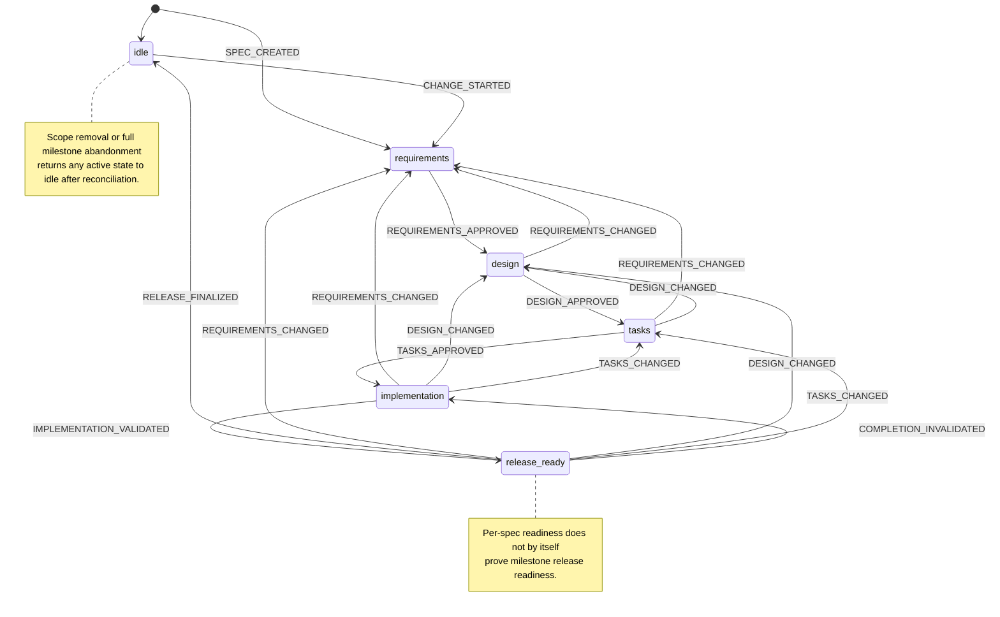

# Spec state machine

Status: Draft

This document defines the target per-spec workflow states and events stored through `spec.yaml` under [Decision 0014](./decisions/0014-structured-spec-metadata.md). It refines the lifecycle described in [Active spec lifecycle](./active-spec-lifecycle.md), the active requirement set accepted in [Decision 0003](./decisions/0003-active-requirement-set.md), and the approval modes accepted in [Decision 0012](./decisions/0012-delegated-approval.md).

The state machine describes one spec's active change. Milestone-wide scope, ordering, target release binding, and roadmap archival remain milestone concerns.

## Modeling decisions

- `spec.yaml` has one authoritative workflow state instead of separately writable `phase`, `generated`, `approved`, and `ready_for_implementation` booleans.
- `active_change: null` represents the released and idle state.
- An active change stores its workflow state inside `active_change.state`.
- A new spec is created directly in `requirements`; absence before `SPEC_CREATED` is not a persisted lifecycle state.
- Approval records are evidence for gates already crossed. They do not independently determine the state.
- Gate approval is `explicit` or run-scoped `delegated`; non-interactive execution does not itself authorize either mode.
- Manual edits that invalidate approved input rewind the state to the earliest affected gate.
- Missing files, stale approval evidence, and other contradictions produce a derived consistency failure. `inconsistent` is not written as a competing workflow state.
- Document generation does not itself cross a gate. A state advances only when the corresponding approval event succeeds.
- Accelerated and batch workflows emit the same events and satisfy the same guards as phase-by-phase workflows.

This removes invalid combinations such as `phase: "tasks-generated"` with unapproved requirements, while retaining explicit evidence of how each gate was crossed.

## State list

| State | Persistent representation | Meaning | Minimum consistent artifacts and metadata |
| --- | --- | --- | --- |
| `idle` | `active_change: null` | The current requirements, design, and contract describe released behavior. No change for this spec is active. | `requirements.md`, `design.md`, `contract.md`, `changelog.md`, and released metadata; no `brief.md` or `tasks.yaml`. |
| `requirements` | `active_change.state: "requirements"` | The active change is being scoped and its current Requirement ID set is not yet approved. | Active roadmap membership, `brief.md`, `requirements.md`, matching milestone and change IDs, and `requirement_ids: null`. |
| `design` | `active_change.state: "design"` | Requirements and the active Requirement ID set are approved. Technical design and contract impact are being established or revised. | Requirements gate evidence and a non-null, canonical `requirement_ids` array. |
| `tasks` | `active_change.state: "tasks"` | Design and contract impact are approved. The executable milestone-local plan is being prepared or revised. | Valid requirements and design gate evidence plus current `design.md` and `contract.md`. |
| `implementation` | `active_change.state: "implementation"` | The task plan is approved and implementation or validation remains incomplete. | Valid requirements, design, and tasks gate evidence plus `tasks.yaml`. |
| `release_ready` | `active_change.state: "release_ready"` | Spec-level implementation, integration, and coverage have fresh accepted evidence, and any required roadmap-owned downstream review is current. Milestone release gates may still block publication. | Valid prior gate evidence, zero incomplete or blocked tasks, fresh completion evidence, and a current applicable roadmap review record. |

`release_ready` is deliberately per spec. A milestone is release-ready only when all participating specs, direct items, project checks, target-version requirements, and release-adapter prerequisites pass their respective gates.

## Conceptual `spec.yaml` shape

The exact schema and digest format remain to be accepted, but the state model requires this distinction:

```yaml
schema_version: 1
feature_name: example
language: en
active_change:
  milestone_id: <generated-id>
  change_id: <stable-id>
  state: design
  requirement_ids:
    - "1.1"
    - "1.2"
  gate_evidence:
    requirements:
      passed_at: <timestamp>
      approval_mode: delegated
      delegation_workflow: specbind-spec-quick
      approved_requirement_ids:
        - "1.1"
        - "1.2"
      input_revisions:
        requirements.md: <fingerprint>
```

Gate evidence must identify the approved input revision strongly enough for the CLI to detect a later out-of-band edit. Fingerprint values use the `sha256:<64 lowercase hex characters>` representation accepted in [Decision 0016](./decisions/0016-fingerprint-value-format.md). The requirements gate covers `requirements.md` and the ordered active Requirement ID set but excludes `brief.md` under [Decision 0017](./decisions/0017-requirements-gate-inputs.md). Markdown line endings are normalized before hashing, while the ordered Requirement IDs are stored directly as `approved_requirement_ids` and compared by exact array equality under [Decision 0018](./decisions/0018-gate-input-comparison.md). The design gate fingerprints exactly the normalized `design.md` and required `contract.md` under [Decision 0038](./decisions/0038-design-gate-inputs.md). The tasks gate stores only the normalized typed `plan` projection fingerprint at `input_revisions["tasks.yaml#plan"]` under [Decisions 0028](./decisions/0028-task-plan-fingerprint.md) and [0039](./decisions/0039-minimal-tasks-gate-evidence.md). Every gate uses a timezone-qualified RFC 3339 `passed_at` under [Decision 0036](./decisions/0036-rfc3339-gate-timestamps.md) for the time that the current revision passed; gate transition and evidence persistence are one guarded mutation, so the target schema has no separate `approved_at` or `recorded_at`. `explicit` records approval after the current revision exists and omits `delegation_workflow`. `delegated` requires `delegation_workflow` to identify the accelerated or batch workflow that crossed the gate. The delegation itself remains only in that workflow's run context and is not persisted in `spec.yaml` or another project artifact. Both modes satisfy the same gate guards; only the post-gate confirmation pause differs. `--non-interactive` controls prompting and never creates approval authority.

Under [Decision 0032](./decisions/0032-gate-local-freshness-chain.md), each gate owns only its direct input revision data and requires every prerequisite gate to remain fresh. A later workflow may read upstream artifacts without duplicating their fingerprints in its own evidence. The CLI reports the earliest stale gate and derives all downstream staleness from that chain.

Under [Decision 0037](./decisions/0037-minimal-completion-evidence-shape.md), `gate_evidence.completion` contains exactly `passed_at`, `implementation_revision`, and `mechanical_checks`. All three are required and no additional completion fields are accepted.

Under [Decision 0040](./decisions/0040-state-gate-evidence-invariants.md), gate evidence is sparse and cumulative: the `requirements` state has no `gate_evidence` container, while `design`, `tasks`, `implementation`, and `release_ready` require exactly the cumulative evidence sets shown in that decision. JSON Schema validates the non-empty container and nested shapes; lifecycle semantic validation reports missing or premature evidence relative to the declared state. Approved `requirement_ids` are non-empty from `design` onward.

## Event list

### State-changing events

| Event | Meaning | Principal producer |
| --- | --- | --- |
| `SPEC_CREATED` | Create a new spec directly inside the active milestone and open its first active change. | Discovery confirms the route; spec initialization authors the scaffold; the Rust CLI applies the guarded mutation. |
| `CHANGE_STARTED` | Open one active change for an idle spec in the active milestone. | Discovery authors the confirmed intent; the Rust CLI applies the guarded mutation. |
| `REQUIREMENTS_APPROVED` | Approve the current requirements and freeze the active Requirement ID set. | Requirements workflow through the Rust CLI contract. |
| `REQUIREMENTS_CHANGED` | Declare that approved requirements or active scope changed and invalidate every downstream gate. | Requirements or discovery workflow through the Rust CLI contract. |
| `DESIGN_APPROVED` | Approve design, requirement traceability, contract contents, and contract-impact analysis. | Design workflow through the Rust CLI contract. |
| `DESIGN_CHANGED` | Declare that approved design or contract input changed and invalidate design and downstream gates. | Design or cross-spec review workflow through the Rust CLI contract. |
| `TASKS_APPROVED` | Approve the current executable task plan and its complete active-requirement coverage. | Tasks workflow through the Rust CLI contract. |
| `TASKS_CHANGED` | Declare that the approved task plan changed and invalidate tasks and completion gates. | Tasks or implementation workflow through the Rust CLI contract. |
| `IMPLEMENTATION_VALIDATED` | Accept fresh spec-level completion while requiring the applicable roadmap-owned contract-impact and downstream-review record to be current. | Integration validation / completion workflow through the Rust CLI contract. |
| `COMPLETION_INVALIDATED` | Declare that code, required verification input, or accepted completion evidence changed. | Implementation, validation, or status repair workflow through the Rust CLI contract. |
| `RELEASE_FINALIZED` | Finalize the verified release and return the spec to released / idle state. | Rust CLI release finalization. |
| `SPEC_SCOPE_REMOVED` | Remove this spec's unreleased change from the active milestone after confirmed scope revision and content reconciliation. | Discovery confirms intent; the Rust CLI applies cleanup. |
| `MILESTONE_ABANDONED` | Clear this spec's active change as part of an explicitly confirmed, fully reconciled milestone abandonment. | Rust CLI milestone abandonment operation. |

### Non-transitioning events

These operations may update documents or milestone context without advancing the per-spec state:

| Event | Effect |
| --- | --- |
| `REQUIREMENTS_DRAFT_UPDATED` | Writes or revises requirements while the state remains `requirements`. |
| `DESIGN_DRAFT_UPDATED` | Writes or revises design and contract while the state remains `design`. |
| `TASK_PLAN_UPDATED` | Writes or revises tasks while the state remains `tasks`. |
| `TASK_PROGRESS_RECORDED` | Updates task completion while the state remains `implementation`. |
| `TARGET_RELEASE_BOUND` | Updates the milestone's release binding; it does not advance a participating spec. |
| `MILESTONE_SCOPE_REORDERED` | Changes milestone ordering or dependencies without changing a spec gate unless the semantic scope also changes. |
| `STATE_REPAIRED` | Restores artifacts or metadata to match the declared state; the workflow state itself does not change. |

If a draft update touches input that has already been approved, it is not a non-transitioning draft event. The workflow must emit the corresponding `*_CHANGED` invalidation event first.

## State transition table

`Current` lists the states from which the event is valid. Repeating an event against its already-realized target may return an idempotent no-op only when the inputs and recorded evidence are identical; otherwise it is a conflict.

| Event | Current | Next | Required guards | Atomic state effects |
| --- | --- | --- | --- | --- |
| `SPEC_CREATED` | Spec does not exist | `requirements` | An active roadmap exists; the new spec boundary and name are confirmed in scope; no conflicting spec path exists; milestone and change IDs are unique; an active brief and initial requirements scaffold are available. | Create the persistent spec artifacts and `active_change`; set `requirement_ids: null`; create no approval evidence. |
| `CHANGE_STARTED` | `idle` | `requirements` | An active roadmap exists; the spec is confirmed in scope; no active change exists; milestone and change IDs are unique; an active brief is available. | Create `active_change`; set `requirement_ids: null`; create no approval evidence. |
| `REQUIREMENTS_APPROVED` | `requirements` | `design` | Requirements review passed; canonical IDs are valid and unique; the selected active set has valid explicit or delegated approval and is normally non-empty. | Freeze the ordered active set; record requirements gate evidence. |
| `REQUIREMENTS_CHANGED` | Any active state | `requirements` | The changed scope belongs to the same active change, or discovery has confirmed the revised route. | Set `requirement_ids: null`; clear requirements, design, tasks, and completion gate evidence; retain downstream documents only as stale repair input. |
| `DESIGN_APPROVED` | `design` | `tasks` | Requirements evidence is current; design covers every active Requirement ID; contract structure and impact review pass; explicit or delegated approval is valid for the current revision. | Record design and contract gate evidence. |
| `DESIGN_CHANGED` | `design`, `tasks`, `implementation`, `release_ready` | `design` | Requirements and active set remain valid; otherwise use `REQUIREMENTS_CHANGED`. | Clear design, tasks, and completion gate evidence; retain requirements evidence. |
| `TASKS_APPROVED` | `tasks` | `implementation` | Requirements and design evidence are current; every active Requirement ID maps to an executable task; task review passes; explicit or delegated approval is valid for the current revision. | Record tasks gate evidence. |
| `TASKS_CHANGED` | `tasks`, `implementation`, `release_ready` | `tasks` | Requirements and design remain valid; otherwise use the earlier invalidation event. | Clear tasks and completion gate evidence. |
| `IMPLEMENTATION_VALIDATED` | `implementation` | `release_ready` | Required tasks are complete and unblocked; the mandatory semantic validation protocol produces `GO`; the applicable roadmap-owned contract-impact and downstream-review record is current; the unchanged clean Git revision and lifecycle inputs satisfy the Decision 0029 handshake. | Atomically record spec-local completion evidence and its input revisions, then transition. Semantic pass flags and cross-spec review data are not copied into `spec.yaml` under Decisions 0034 and 0035. |
| `COMPLETION_INVALIDATED` | `release_ready` | `implementation` | Requirements, design, contract, and tasks remain approved; the validated implementation revision or another completion input changed; otherwise use the corresponding earlier invalidation event. | Clear completion evidence only. |
| `RELEASE_FINALIZED` | `release_ready` | `idle` | Milestone release preflight, publication, verification, immutable-reference checks, and final invariant recheck pass for every participant. | Append idempotent changelog entry; remove this change's `brief.md` and `tasks.yaml`; clear `active_change`. Roadmap archival is part of the enclosing milestone transaction. |
| `SPEC_SCOPE_REMOVED` | Any active state | `idle` | Scope removal is confirmed; unstarted work or repository/spec content is restored and reconciled; no retained consumer dependency requires this active revision. | Remove milestone-local files for this change; clear `active_change`; create no release changelog entry. |
| `MILESTONE_ABANDONED` | Any active state | `idle` | Full abandonment is explicitly confirmed; every participating spec and repository change is restored or reconciled. | Apply the same per-spec cleanup as scope removal as one milestone-wide guarded operation; remove the active roadmap; create no release history by default. |

Events received from an invalid current state fail without mutation and return a stable diagnostic. The CLI must never repair an invalid transition by silently skipping a required gate.

## Invalidation rules

The rewind target is the earliest gate whose approved input changed:

| Changed input | Rewind target | Evidence invalidated | Evidence retained |
| --- | --- | --- | --- |
| Requirements, active Requirement IDs, or user-visible scope | `requirements` | Requirements, design, tasks, completion | None |
| Design, contract entries, contract classification, or required downstream-review scope | `design` | Design, tasks, completion | Requirements |
| Task contents, coverage mapping, dependency order, or required task set | `tasks` | Tasks, completion | Requirements, design |
| Implementation content or verification inputs only | `implementation` | Completion | Requirements, design, tasks |

Rewinding does not automatically delete prose documents. It marks them as unapproved inputs so the responsible workflow can revise, replace, or deliberately reuse them. Destructive cleanup remains limited to successful release finalization or confirmed scope removal / abandonment.

## Consistency health

Workflow state and consistency health are separate dimensions:

```text
declared workflow state: idle | requirements | design | tasks | implementation | release_ready
derived health:          consistent | inconsistent
```

Examples of `inconsistent` health include:

- an active state without matching roadmap membership or milestone ID
- `requirements` with a non-null approved active set
- `design` or later without current requirements gate evidence
- `tasks` or later without a valid `contract.md`
- `implementation` or later without `tasks.yaml`
- an approval fingerprint that does not match the current artifact revision
- `idle` with milestone-local `brief.md` or `tasks.yaml`

Read-only checks report the declared state, derived health, and repair diagnostics. They do not rewrite state. `STATE_REPAIRED` means an explicit repair operation has restored consistency and passed the same invariant check.

## State transition diagram

The diagram shows the normal forward path and approval invalidation rewinds. `SPEC_SCOPE_REMOVED` and `MILESTONE_ABANDONED` can return any active state to `idle` subject to the guards in the transition table.



## CLI mutation contract

Every state-changing event is an explicit guarded CLI mutation with:

- expected current state and active change identity
- structured event input
- dry-run or plan output where the mutation is destructive
- stable human and JSON diagnostics
- atomic writes across the affected spec artifacts
- an idempotency check for retries
- a post-write consistency check

Milestone-wide events additionally require one coherent mutation across the roadmap and all participating specs. Exact command names belong to the CLI contract and remain Draft.

## Migration from the inherited metadata

The current `spec.json` template stores `phase`, three pairs of `generated` / `approved` booleans, and `ready_for_implementation`. Migration must validate the whole combination before writing `spec.yaml`; `phase` alone is insufficient.

| Validated inherited condition | Initial target state |
| --- | --- |
| No active milestone change and current behavior is released | `idle` |
| Initialized or requirements generated but not approved | `requirements` |
| Requirements approved; design absent or not approved | `design` |
| Design approved; tasks absent or not approved | `tasks` |
| Tasks approved with incomplete work | `implementation` |
| Tasks complete with accepted fresh completion evidence | `release_ready` |

Contradictory flags, missing artifacts, or absent evidence produce an explicit migration diagnostic. Migration must not guess the furthest plausible state or manufacture approval evidence.

## Open questions

- Exact `active_change` container wiring in the root `spec.yaml` schema; the `gate_evidence` container and its state invariants are accepted through Decision 0040.
- Whether one spec may ever need more than one Change ID inside one milestone; the initial state machine assumes one active Change ID whose same-milestone deltas are merged.
- Which repair operations the CLI may automate after presenting a dry-run plan.
- Stable event, state, and diagnostic names in the public CLI and JSON contracts.
