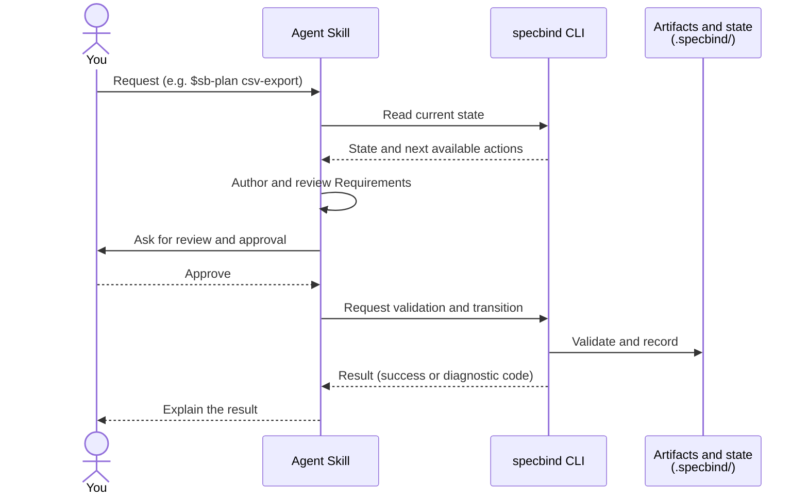

# Core concepts

SpecBind neither delegates everything to an Agent nor requires documents for
every change. It combines Agents that make semantic judgments with a CLI that
validates and records state, preserving the relationship between specification
and implementation over time.

## Skills and the CLI

| Owner | Main responsibilities |
| --- | --- |
| Agent Skills | Scope judgment, Requirements and Design authoring, review, implementation, and explanation |
| `specbind` CLI | Structural validation, traceability, approval evidence, progress, lifecycle transitions, and release preflight |
| You | Scope confirmation, required approvals, project-specific choices, and confirmation of published results |

Skills do not edit CLI-owned state directly. The CLI does not judge whether a
Requirement is correct or a Design is sound. Passing through both layers avoids
formally valid but meaningless artifacts and plausible prose that bypasses the
lifecycle.

You make requests to Skills. Skills run the CLI, and only the CLI records
artifact state. Authoring Requirements, for example, flows like this:



Read-only commands such as `specbind milestone status` are also safe to run
yourself when you want to inspect state.

## Spec

A Spec is one durable capability or responsibility boundary. It is not a
disposable change plan. Later Milestones update the same Spec's Requirements,
Design, and Contract as the complete current truth. Specs remain after release
and become the starting point for the next change.

The default path is `.specbind/specs/<spec>/`, where `<spec>` is a short
kebab-case responsibility ID.

## Milestone and Roadmap

A Milestone groups work delivered as one release. Its Roadmap records
Spec-backed items, Direct items, dependencies, and the target release. Only one
Milestone may be active in a project. The current Roadmap normally lives at
`.specbind/steering/roadmap.md`; after release, the CLI moves it to the release
archive.

Once work enters a Milestone, it remains tracked inside that release boundary
even if it could otherwise be a small standalone change.

## Spec-backed and Direct items

Discovery classifies work by ownership, not size.

| Type | When selected | Artifacts |
| --- | --- | --- |
| Existing-Spec update | Changes behavior or boundaries owned by an existing Spec | Updated Requirements, Design, Contract, and Tasks |
| New Spec | Adds a durable project responsibility | New Requirements, Design, Contract, and Tasks |
| Direct | Belongs to no Spec and changes no Spec Requirements, Design, or Contract | Roadmap summary and completion state |

A large change may remain one existing-Spec update; a small change may require a
new Spec. If Direct implementation reveals a Spec specification or Contract change,
stop and return to Discovery instead of adding artifacts ad hoc.

## Discovery source collections

Discovery can accept a tracked project file or directory, or an explicitly
identified GitHub repository Milestone, as one Source Collection. It inventories
every source item, records each item's Roadmap destination or exclusion reason,
and lists only a Spec's relevant items in its Brief. An unreadable local item,
inaccessible GitHub entry, or incomplete GitHub page stops the collection rather
than allowing partial coverage. A GitHub Milestone may name `OWNER/REPO` and its
Milestone number separately, or use the exact canonical URL
`https://github.com/OWNER/REPO/milestone/NUMBER`; other URL shapes are rejected.
Open and closed Issues are included, while comments and timeline events are not
source material.

When the whole Milestone title has a version shape such as `v1`, `v1.4.0`,
`1.4.0-rc.1`, or `2026-09-06`, Discovery binds that exact title as the target
release. The proposed value is included in the ordinary scope confirmation;
initial binding needs no separate version question. Discovery does not extract
a version from prose such as `Release v1.4.0` or normalize the title. An
explicitly supplied release label takes precedence. Replacing a different
existing binding requires confirmation after showing both values.

Source material is input, not authoritative specification. Requirements and
Design read the Brief-declared sources and promote accepted behavior and
technical conclusions into their own artifacts. Remote source context is
captured during Discovery and is not silently re-queried. Updating any source
does not automatically synchronize downstream artifacts; rerun Discovery
explicitly for the intended scope.

## Durable and Milestone-local artifacts

| Kind | Examples | Lifecycle |
| --- | --- | --- |
| Durable | `spec.yaml`, `requirements.md`, `design.md`, `contract.yaml`, `log.md` | Retained as current Spec truth and history |
| Milestone-local | `brief.md`, `research.md`, `tasks.yaml` | Used for the active change and cleaned up at release |
| Project-wide | `steering/roadmap.md`, Steering documents, Contract review | Holds cross-Spec scope and decisions |

Requirements and Design are complete current contracts, not change-only notes.
Statements that remain true stay in the current document.

## Gates and approval

Requirements, Design, and Tasks each have a Gate. Approval is evidence tied to
the reviewed input revision and fingerprint, not an unqualified checkbox.
Changing upstream artifacts therefore invalidates or stales affected downstream
approval and completion evidence.

Approval may be:

- **explicit** — you review and approve at that Gate; or
- **delegated** — you authorize a named run such as `sb-plan` to approve
  specified Gates after their normal reviews and checks pass.

Delegation does not skip review and does not authorize invalidating an existing
Gate or accepting Contract review.

## Contract review

Design includes outward responsibilities, dependencies, and file ownership in
a structured Contract. Before Tasks are authored, all active-Milestone
Contracts are reviewed together, even when there is only one Spec. This exposes
ownership overlap, cycles, compatibility assumptions, and integration gaps
before implementation.

Read the resolved graph without changing source Contracts:

```sh
specbind contract graph
specbind contract dependencies <spec>
specbind contract consumers <spec>
specbind contract owners <project-relative-path>
```

`owners` matches one concrete project-relative path against exact and subtree
File Ownership declarations. A match identifies managed boundary candidates;
no match does not decide that the requested behavior belongs to no Spec. Unless
an active Roadmap item already matches, even an imperative request naming that
file enters Discovery and waits at scope confirmation before implementation.

## Project shared Contract

Resources used by several features, such as translation catalogs, can have a
shared Contract without a dedicated Spec. The optional
`.specbind/specs/shared-contract.yaml` declares resource IDs, paths, change
policies, and invariants. It survives release and has no independent Gates or
Tasks.

```yaml
schema_version: 1
resources:
  - id: translations
    description: Japanese and English translation catalogs
    paths: [locales/ja.json, locales/en.json]
    change_policy: Each feature updates its namespace in both languages.
    invariants: [Keys and interpolation variables match across languages.]
```

Changes within the existing rules, such as adding translations, belong to each
feature Spec's Tasks and leave the shared Contract unchanged. Changing the rules
themselves starts in Discovery and goes through Contract review. See
"Project shared Contract" in [Customize SpecBind](./customization.md#shared-contract)
for inspection commands and the change procedure.

## Invalidation and rewind

When implementation reveals an upstream problem, do not patch Requirements,
Design, Contract, or Tasks from the implementation workflow. Stop, diagnose the
owner, explicitly invalidate the affected Gate, revise through that phase's
Skill, and then rebuild downstream approvals.

```text
Implementation observation
  -> fresh diagnosis
  -> explicit Gate invalidation
  -> owning planning phase
  -> downstream review and approval
  -> implementation resumes
```

!!! note "Removing a Requirement"
    Do not delete an established Requirement group or Acceptance Criterion.
    Retire it with a `_Retired_` marker instead; see "Retire an obligation" in
    [Plan and implement one item at a time](./implement-step-by-step.md#retire-requirements).
    Retiring every obligation of a Spec is not yet supported in v1.

## Ordinary lifecycle

```text
Discovery
  -> Requirements
  -> Design and independent validation
  -> Milestone-wide Contract review
  -> Tasks
  -> implementation and per-Task review
  -> Spec completion validation
  -> release and finalization
```

`sb-plan` is the default entry from Requirements through Tasks approval.
Use a named Spec or `--all`; an invocation without scope first asks which scope
you intend. An explicit request for one named Spec and one Requirements,
Design, or Tasks phase uses that phase's procedure from the same Plan Skill.
`sb-implement` handles exactly one Roadmap item at a time.
`sb-drive` selects safely reachable owning workflows across the Milestone
one at a time and rereads CLI state after every handoff. It parks branch-local
attention and continues independent work, but never executes Release.

## Project-owned configuration

Templates, Rules, and adapters below `.specbind/settings/`, plus Steering below
`.specbind/steering/`, are project-owned. Product-managed Skills, protocols,
schemas, and CLI state transitions are not. Use `sb-configure` to route a
change to the correct owner and complete its verification and aftercare.

Codex and generic integrations share `.agents/skills/`; Claude Code uses
`.claude/skills/`. Agent-specific role files adapt planner, implementer,
reviewer, debugger, and researcher capabilities without changing the shared
Skill contract.

## Next

- [Choose a route](./getting-started.md)
- [Plan and implement one item at a time](./implement-step-by-step.md)
- [Plan and Drive a Milestone](./implement-with-plan-and-drive.md)
- [Customize SpecBind](./customization.md)
- [Release a milestone](./release.md)

---

[User guide](../index.md) | [Plan and implement one item at a time](./implement-step-by-step.md) | [Plan and Drive a Milestone](./implement-with-plan-and-drive.md)
