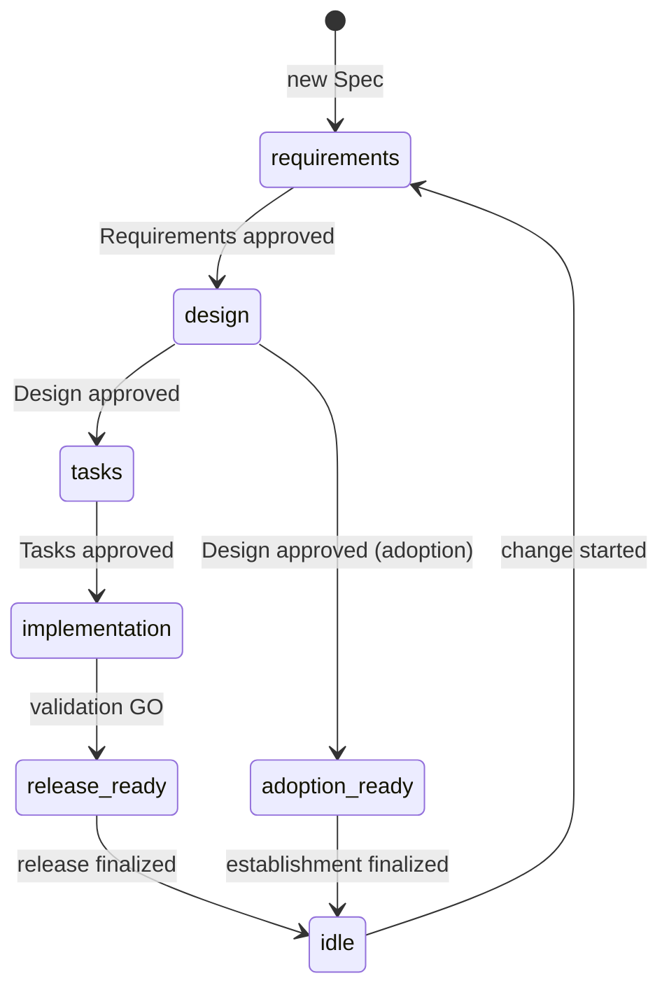

# Lifecycle states

This page explains the state names that `specbind spec status` and
`specbind milestone status` report, and which Skill usually moves work forward
from each one. For the concepts behind them, see
[Core concepts](../guide/concepts.md).

## Spec states

`specbind spec status <spec>` reports one state per Spec.

| State | Meaning | Usually next |
| --- | --- | --- |
| `idle` | No change is active. Requirements, Design, and Contract describe released behavior. | `sb-discovery` to start a change |
| `requirements` | Requirements are being written or revised and are not yet approved. | `sb-plan <spec> requirements` |
| `design` | Requirements are approved. Design and Contract are being written or revised. | `sb-plan <spec> design` |
| `tasks` | Design is approved. The Task plan is being prepared, after the Milestone-wide Contract review. | `sb-contract-review`, then `sb-plan <spec> tasks` |
| `implementation` | Tasks are approved. Implementation or final validation remains. | `sb-implement`, then `sb-validate-implementation` |
| `release_ready` | This Spec's implementation is validated. The Milestone may still wait for other items or release work. | `sb-release` once the whole Milestone is ready |
| `adoption_ready` | Only while establishing Specs from an existing implementation: Requirements and Design are approved. | `sb-adopt` continues to Contract review and finalization |

When an approved input changes, the Spec moves back to the state of the
earliest affected Gate, as described in
[Invalidation and rewind](../guide/concepts.md#invalidation-and-rewind). For
example, changing Requirements in `implementation` returns the Spec to
`requirements`. Removing a Spec from the Milestone or abandoning the Milestone
returns it to `idle`.

## Milestone stages

`specbind milestone status` reports one stage for the active Milestone: the
earliest step that is not yet complete across all its items. Individual items
may already be further ahead.

| Stage | Meaning | Usually next |
| --- | --- | --- |
| `requirements` | At least one Spec still needs Requirements approval. | `sb-plan` |
| `design` | At least one Spec still needs Design approval. | `sb-plan` |
| `contract_review` | Every Design is approved, but the Milestone-wide Contract review is missing or out of date. | `sb-contract-review` |
| `tasks` | The review is current, but at least one Spec still needs Tasks approval. | `sb-plan` |
| `implementation` | At least one Roadmap item is not yet implemented. | `sb-implement` or `sb-drive` |
| `validation` | Everything is implemented, but at least one Spec lacks current completion evidence. | `sb-validate-implementation` |
| `release_pending` | Delivery is complete, but something still blocks release, such as an unbound target version. The status lists the blockers. | Resolve the listed blockers, often through `sb-release` |
| `release_ready` | Every release check passes. | `sb-release` |
| `adoption_ready` | Only while establishing Specs from an existing implementation: Designs and Contract review are current. | `sb-adopt` finalizes |

A Milestone with only Direct items skips the Spec stages and starts at
`implementation`. A Milestone that establishes Specs from an existing
implementation stops at `adoption_ready` and never reaches Tasks or release.

When no Milestone is active, `milestone status` reports `NO_ACTIVE_MILESTONE`.
Start the next one with `sb-discovery`.
