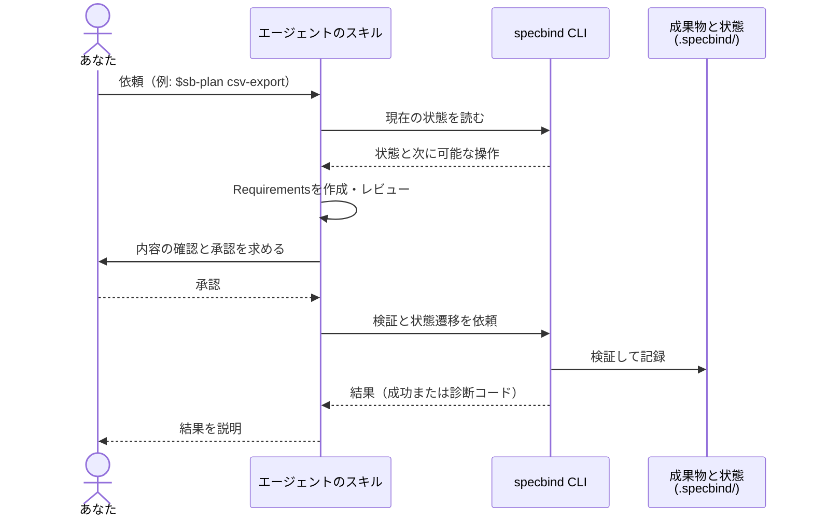
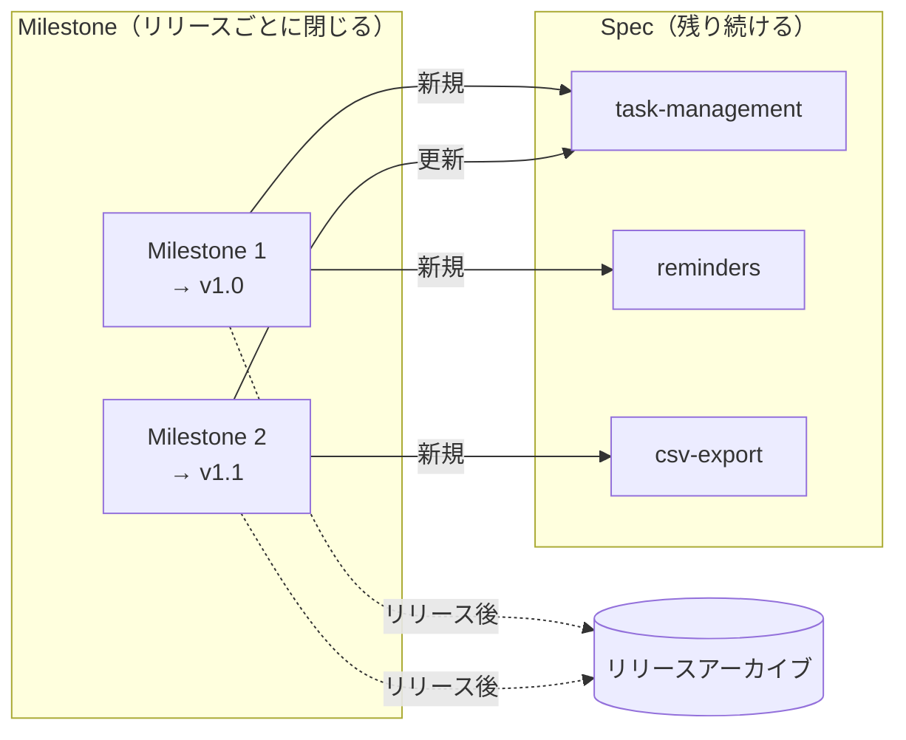
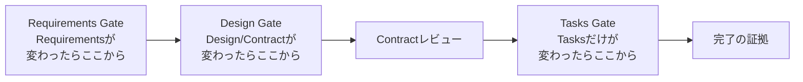
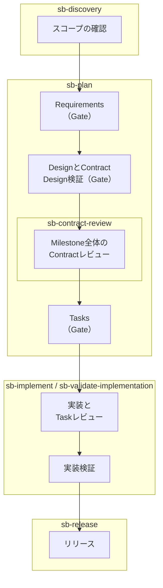

# 基本概念

SpecBindは、エージェントにすべてを任せる仕組みでも、どんな変更にも文書作成を
求める仕組みでもありません。意味を判断するエージェントと、状態を検証して記録
するCLIを組み合わせることで、仕様と実装の関係を長く保ちます。

## スキルとCLI

SpecBindでは、責任を次のように分けています。

| 担当 | 主な責任 |
| --- | --- |
| エージェントのスキル | スコープ判断、RequirementsやDesignの作成、レビュー、実装、結果の説明 |
| `specbind` CLI | 構造検証、トレーサビリティ、承認の証拠、進捗、状態遷移、リリース前チェック |
| あなた | スコープの確定、必要な承認、プロジェクト固有の判断、公開結果の確認 |

スキルはCLIが持つ状態を直接書き換えません。逆にCLIは、Requirementsの意味が
正しいか、Designが妥当かといった判断をしません。両方の層を必ず通すことで、
形式だけ整った仕様や、内容はもっともらしいのに状態遷移を飛ばした作業を防ぎます。

あなたが依頼する相手はスキルです。CLIを実行するのはスキルで、成果物の状態を
記録するのはCLIだけです。たとえばRequirementsを作成するときは、次のように
やりとりします。



なお、`specbind milestone status`のような読み取り専用のコマンドは、状態を
確認するために自分で直接実行してもかまいません。

## Spec

Specは、プロジェクトが持ち続ける1つの能力、あるいは責任の境界です。

Specは変更のたびに使い捨てる計画書ではありません。あとのMilestoneで同じ能力を
変更するときは、同じSpecのRequirements、Design、Contractを「現在の姿」として
更新します。リリース後もSpecは残り、次の変更の出発点になります。

Specの既定の置き場所は`.specbind/specs/<spec>/`です。`<spec>`には、その責任を
表す短いkebab-caseのIDを使います。

## MilestoneとRoadmap

Milestoneは、1回のリリースとしてまとめて届ける作業の単位です。Specに基づく作業項目
（Spec-backed item）、Direct項目、項目どうしの依存関係、対象リリースをRoadmapに
記録します。

同時に進行できるMilestoneは、プロジェクトごとに1つだけです。現在のRoadmapは
`.specbind/steering/roadmap.md`にあり、状態はCLIが管理します。リリースが完了
すると、Roadmapの内容はリリースアーカイブへ移ります。

SpecとMilestoneは寿命が異なります。Milestoneはリリースごとに閉じますが、Specは
残り続け、次のMilestoneでも同じSpecを更新します。



いったんMilestoneに入れた作業は、単独なら通常の作業で済むような小さな変更でも、
同じリリース境界の中で追跡します。

## Spec項目とDirect項目

Discoveryは、ワークフローに入ってきた作業を「誰が所有するか」で分類します。

| 種類 | 選ばれる条件 | 持つもの |
| --- | --- | --- |
| 既存Specの更新 | 既存Specが所有する振る舞いや境界を変更する | 更新されたRequirements、Design、Contract、Tasks |
| 新規Spec | プロジェクトに新しい責務を追加し、今後も持ち続ける | 新しいRequirements、Design、Contract、Tasks |
| Direct | どのSpecにも属さず、SpecのRequirements、Design、Contractを変えない | Roadmap上の要約と完了状態 |

分類を決めるのは作業量ではなく所有権です。大きな変更でも、既存の1つの責任の中に
収まるなら既存Specの更新です。逆に小さな変更でも、新しい責務が生まれるなら
新規Specになります。

Directとして始めた作業が、実はSpecの仕様やContractの変更を必要とすると分かった場合は、
その場で成果物を足さずに、Discoveryへ戻して分類をやり直します。

## DiscoveryのSource Collection

Discoveryには、入力資料をひとまとまりのSource Collectionとして渡せます。渡せるのは
次の2種類です。

- プロジェクト内のGitで追跡済みのテキストファイル、またはディレクトリ
- 明示したGitHubリポジトリのMilestone

Discoveryはコレクション全体を棚卸しし、RoadmapにすべてのSource Itemの振り分けを、
各BriefにそのSpecが参照する項目だけを記録します。読めないローカル項目、アクセス
できないGitHub項目、GitHubの不完全なページ送りがあれば、一部だけを使って進めずに
停止します。

GitHub Milestoneの指定方法は次のどちらかで、ほかのURL形式は受け付けません。

- `OWNER/REPO`とMilestone番号を別々に指定する
- 厳密な正規URLの`https://github.com/OWNER/REPO/milestone/NUMBER`を指定する

対象はopenとclosedのIssueです。コメントとタイムラインイベントは入力資料では
ありません。

Milestone名が`v1`、`v1.4.0`、`1.4.0-rc.1`、`2026-09-06`などの
バージョン形式なら、その名前をそのまま対象リリースに紐付けます。予定値は通常の
スコープ確認に含まれ、初回の紐付けで別途バージョンを尋ねることはありません。
`Release v1.4.0`のような文章からの抜き出しや表記の変更は行いません。
明示したリリース名があればそちらを優先し、既に異なる値が紐付いている場合は、
現在値と変更先を示して置き換えを確認します。

Source Collectionは正規の仕様そのものではありません。RequirementsとDesignは
Briefが指定した資料を読み、採用する振る舞いや技術上の結論を自身の成果物へ
書き直します。リモートの入力文脈はDiscovery時に確定し、後続の工程で黙って
再取得しません。元資料を更新した場合は自動同期されないため、必要な範囲を指定して
Discoveryを明示的にやり直します。

## 永続成果物とMilestone固有成果物

Spec項目の成果物には、リリース後も残るものと、Milestoneが進行中の間だけ
存在するものがあります。

| 種類 | 代表例 | ライフサイクル |
| --- | --- | --- |
| 永続 | `spec.yaml`、`requirements.md`、`design.md`、`contract.yaml`、`log.md` | Specの現在の姿と履歴として残る |
| Milestone固有 | `brief.md`、`research.md`、`tasks.yaml` | 進行中の変更を進めるために使い、リリース完了時に片付ける |
| プロジェクト全体 | `steering/roadmap.md`、Steering文書、Contractレビュー | 複数のSpecにまたがるスコープと判断を保持する |

RequirementsとDesignは差分メモではありません。どちらも、現在有効な契約の全体を
表します。以前から変えない記述も、そのまま現在の文書の中に残してください。

## Gateと承認

Requirements、Design、TasksにはそれぞれGateがあります。Gateの承認は単なる
チェック印ではなく、レビューした入力のリビジョンとフィンガープリントに結び付いた証拠です。

そのため、上流の成果物が変わると、影響を受ける下流の承認や、完了を裏付ける記録
（completion evidence）は無効、または古い状態になります。エージェントが古いDesignや
Tasksのまま黙って進んでしまうのを防ぐための仕組みです。

承認には2つの形があります。

- **明示的な承認（explicit）** — あなたがそのGateで内容を確認して承認する
- **委任による承認（delegated）** — `sb-plan`など、名前の付いた1回の実行に対して、承認を
  あらかじめ委任する

委任しても、レビューや検査は省略されません。また、承認済みGateを破棄したり、
Contractレビューを受理したりする権限までは委任されません。

## Contractレビュー

Designには、そのSpecの内部構造だけでなく、外部へ公開する責任、依存、ファイルの
所有境界も含まれます。この部分をContractとして維持します。

Tasksを作る前に、進行中のMilestoneに含まれる全SpecのContractをまとめてレビュー
します。Specが1つしかないMilestoneでも、このレビューは省略しません。所有権の
重複、循環依存、互換性の前提、統合時の抜けを、実装前に見つけるためです。

Contract同士の直接の依存関係は、元の`contract.yaml`を変更せずにCLIから確認できます。

```sh
specbind contract graph
specbind contract dependencies <spec>
specbind contract consumers <spec>
specbind contract owners <project-relative-path>
```

`graph`はプロジェクト全体の解決済み参照、`dependencies`は指定したSpecが利用する
提供側、`consumers`は指定したSpecを利用する管理対象の利用側を表示します。
いずれも直接参照の機械的な投影です。到達可能なSpecが実際に変更の影響を受けるか、
SpecBind管理外の利用側が存在するかは、Contractレビューで判断します。

`owners`は、具体的なプロジェクト相対パスを、Contractの完全一致またはサブツリーの
File Ownership宣言と照合します。一致結果は管理対象の境界候補ですが、一致しないこと
だけでは、その依頼がどのSpecにも属さないとは判断できません。対応する進行中の
Roadmap項目がなければ、ファイルを名指しした命令形の依頼でもDiscoveryへ入り、
実装前にスコープの確認で停止します。

## 共有Contract

翻訳ファイルのように複数の機能が使う資源は、専用のSpecを作らずに共有Contractで
管理できます。任意で置く`.specbind/specs/shared-contract.yaml`に、資源ID、対象パス、
変更規則、不変条件を記録します。共有Contractはリリース後も残りますが、独自のGateや
Tasksは持ちません。

```yaml
schema_version: 1
resources:
  - id: translations
    description: 日英の翻訳カタログ
    paths: [locales/ja.json, locales/en.json]
    change_policy: 各機能は自身の名前空間を両言語で更新する。
    invariants: [言語間でキーと補間変数が一致する。]
```

規則の範囲内の変更（翻訳の追加など）は、各機能のSpecのTaskで行い、共有Contract
自体は変更しません。規則そのものを変える場合はDiscoveryから始め、Contractレビューを
受けます。確認コマンドと変更の手順は、[カスタマイズ](./customization.md#shared-contract)の
「共有Contract」を参照してください。

## 無効化とやり直し

承認したあとで前提が変わったときは、影響を受ける中でいちばん手前のGateを、
明示的に無効化します。



無効化したGateより右側にある承認と証拠は、すべて無効になります。これは失敗ではなく、変わった前提に古い
承認を使わないための、通常のやり直しです。

!!! note "Requirementをなくすとき"
    確立済みのRequirementグループやAcceptance Criterionは削除せず、`_Retired_`
    マーカーで退役させます。書き方は[1件ずつ計画・実装する](./implement-step-by-step.md#retire-requirements)
    の「要件を退役させる」を参照してください。Specのすべての義務を退役させる
    操作には、v1ではまだ対応していません。

## 通常のライフサイクル

Spec項目は、だいたい次の順で進みます。枠の見出しは、その段階を担当するスキルです。



`sb-drive`は、`sb-plan`から実装検証までの範囲を、担当スキルへ順に委譲して進めます。

この流れを進めるスキルは3つです。

**`sb-plan`** — RequirementsからTasks承認までを進める標準の入口です。Specを指定する
とその1件、`--all`または全Specという明示的な依頼ではMilestone内の全Specを対象に
します。対象を付けずに呼び出すと、作業を始める前にどちらかを確認します。各Gateの
承認をこの実行へ委任すれば確認回数を減らせますが、使う成果物、レビュー、CLIの検査は
変わりません。Requirements、Design、Tasksの1フェーズだけを扱う場合も、対象Specと
フェーズを明示して同じ`sb-plan`を使います。

**`sb-implement`** — 1回につき1つのRoadmap項目だけを実装します。

**`sb-drive`** — Milestone全体から安全に到達可能な所有ワークフローを1つずつ選び、
各委譲後にCLI状態を読み直します。局所的な判断待ちは保留して独立項目を続けますが、
リリースは実行せず、その手前で停止します。

## プロジェクト固有の設定

`.specbind/settings/`以下のテンプレート、ルール、アダプターは、プロジェクトの
持ち物です。初回の導入で既定値を作りますが、そのあと`specbind install`を実行
しても、プロジェクト側の設定を上書きしません。

一方、`.agents/skills/sb-*/`と`.claude/skills/sb-*/`はSpecBind製品
側の持ち物です。`specbind install`を再実行すると、Gitに未コミットの変更がないことを
確認したうえで、現在の埋め込み版へ更新します。スキルファイルを直接編集する
やり方は、サポートしているカスタマイズ方法ではありません。
`.agents/skills/`はCodexと`generic`エージェントで共有されます。`generic`は、共通形式の
スキルと`AGENTS.md`だけを導入し、製品固有のサブエージェント定義は作りません。

どの設定に何を書くか、変更できない製品契約との境界、変更後の確認方法は
[カスタマイズ](./customization.md)にまとめています。

## 次に読む

- [ルートを選ぶ](./getting-started.md)
- [1件ずつ計画・実装する](./implement-step-by-step.md)
- [PlanとDriveでMilestoneを進める](./implement-with-plan-and-drive.md)
- [リリースする](./release.md)
- [カスタマイズ](./customization.md)

---

[ユーザーガイド](../index.md) | [1件ずつ計画・実装する](./implement-step-by-step.md) | [PlanとDriveでMilestoneを進める](./implement-with-plan-and-drive.md)
