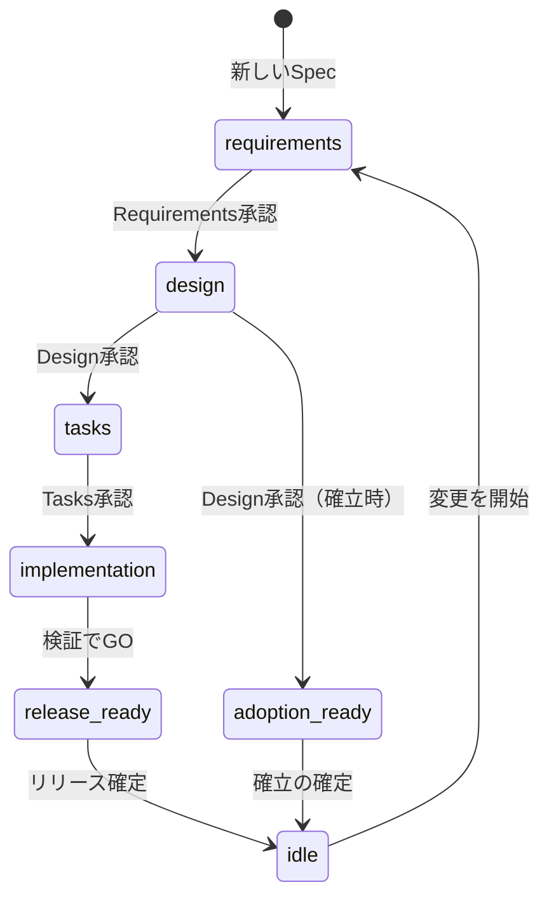

# 状態の一覧

このページでは、`specbind spec status`と`specbind milestone status`が表示する
状態名と、それぞれの状態から作業を進めるときに通常使うスキルをまとめます。
背景となる考え方は[基本概念](../guide/concepts.md)を参照してください。

## Specの状態

`specbind spec status <spec>`は、Specごとに1つの状態を表示します。

| 状態 | 意味 | 通常の次の操作 |
| --- | --- | --- |
| `idle` | 進行中の変更がありません。Requirements、Design、Contractはリリース済みの振る舞いを表しています。 | `sb-discovery`で変更を始める |
| `requirements` | Requirementsを作成・修正中で、まだ承認されていません。 | `sb-plan <spec> requirements` |
| `design` | Requirementsが承認済みで、DesignとContractを作成・修正中です。 | `sb-plan <spec> design` |
| `tasks` | Designが承認済みです。Milestone全体のContractレビューのあと、Taskの計画を準備します。 | `sb-contract-review`、続いて`sb-plan <spec> tasks` |
| `implementation` | Tasksが承認済みで、実装または最終検証が残っています。 | `sb-implement`、続いて`sb-validate-implementation` |
| `release_ready` | このSpecの実装は検証済みです。ほかの項目やリリース作業のため、Milestone全体はまだ待つことがあります。 | Milestone全体の準備ができたら`sb-release` |
| `adoption_ready` | 既存実装からSpecを確立するときだけ使われ、RequirementsとDesignが承認済みの状態です。 | `sb-adopt`がContractレビューと確定処理へ進む |

承認済みの入力が変わると、Specは影響を受けるいちばん手前のGateの状態へ戻ります
（[無効化とやり直し](../guide/concepts.md#invalidation-and-rewind)を参照）。
たとえば`implementation`の状態でRequirementsを変えると、`requirements`へ戻ります。
SpecをMilestoneから外した場合や、Milestoneを中止した場合は`idle`へ戻ります。

## Milestoneの段階

`specbind milestone status`は、進行中のMilestoneについて1つの段階を表示します。
これは、すべての項目を通して、まだ終わっていないいちばん手前の段階です。個々の
項目はそれより先に進んでいることがあります。

| 段階 | 意味 | 通常の次の操作 |
| --- | --- | --- |
| `requirements` | Requirementsの承認が済んでいないSpecがあります。 | `sb-plan` |
| `design` | Designの承認が済んでいないSpecがあります。 | `sb-plan` |
| `contract_review` | すべてのDesignが承認済みですが、Milestone全体のContractレビューがないか、古くなっています。 | `sb-contract-review` |
| `tasks` | レビューは最新ですが、Tasksの承認が済んでいないSpecがあります。 | `sb-plan` |
| `implementation` | 実装が済んでいないRoadmap項目があります。 | `sb-implement`または`sb-drive` |
| `validation` | すべて実装済みですが、最新の完了の証拠がないSpecがあります。 | `sb-validate-implementation` |
| `release_pending` | 実装と検証は完了していますが、対象バージョンの未紐付けなど、リリースを止めているものがあります。表示される理由を確認してください。 | 表示された問題を解消する。多くは`sb-release`で対応 |
| `release_ready` | リリースの確認がすべて通っています。 | `sb-release` |
| `adoption_ready` | 既存実装からSpecを確立するときだけ使われ、DesignとContractレビューが最新の状態です。 | `sb-adopt`が確定処理を行う |

Direct項目だけのMilestoneは、Specの段階を飛ばして`implementation`から始まります。
既存実装からSpecを確立するMilestoneは`adoption_ready`で止まり、Tasksやリリースには
進みません。

進行中のMilestoneがない場合、`milestone status`は`NO_ACTIVE_MILESTONE`を返します。
次のMilestoneは`sb-discovery`で始めます。
